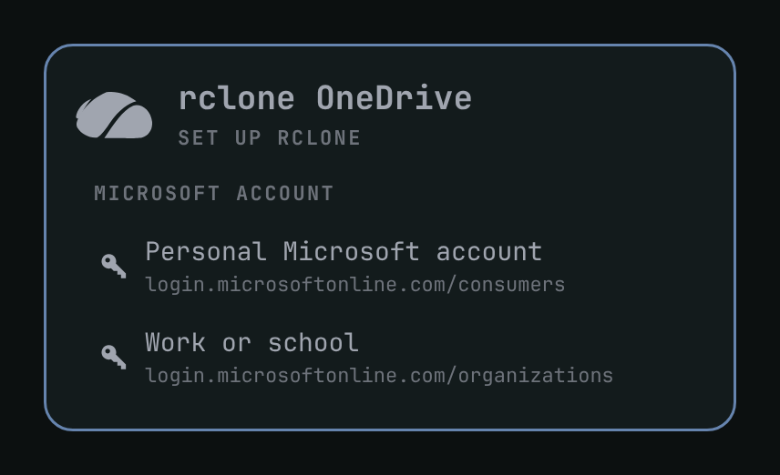
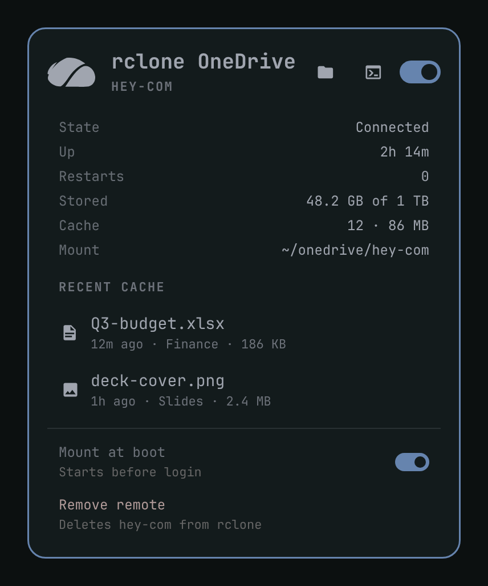

# rclone OneDrive

One click. OneDrive mounted.

Select your personal or work OneDrive account and it mounts automatically after a browser authentication. Your files will be in `~/onedrive/{domain.name}`.

Open in Files or Terminal.

## 1. Install

```bash
omarchy plugin add https://github.com/jason-watts/omarchy-rclone-onedrive.git --enable
omarchy bar move jason-watts.rclone-onedrive --section right
```

Click the cloud icon on the bar.

## 2. Authenticate



Click **Personal Microsoft account** or **Work or school**. Finish sign-in in the browser. The panel comes back, names the remote from the account domain (`omarchy@hey.com` → `hey.com`), and mounts it at `~/onedrive/<name>`.

## 3. Open in Files or Terminal



Use the folder and terminal icons in the panel header. Middle-click the bar icon for Files. `o` opens Files, `t` opens a terminal in the mount.

## 4. Remove

**Remove remote** at the bottom of the panel unmounts, deletes the rclone login, and removes the empty `~/onedrive/<name>` folder. Cloud files stay in OneDrive.

```bash
omarchy plugin remove jason-watts.rclone-onedrive
```

That only removes the plugin. Use **Remove remote** first if you also want the mount gone.

MIT. Needs Omarchy Quattro, Python 3, and `rclone`.
